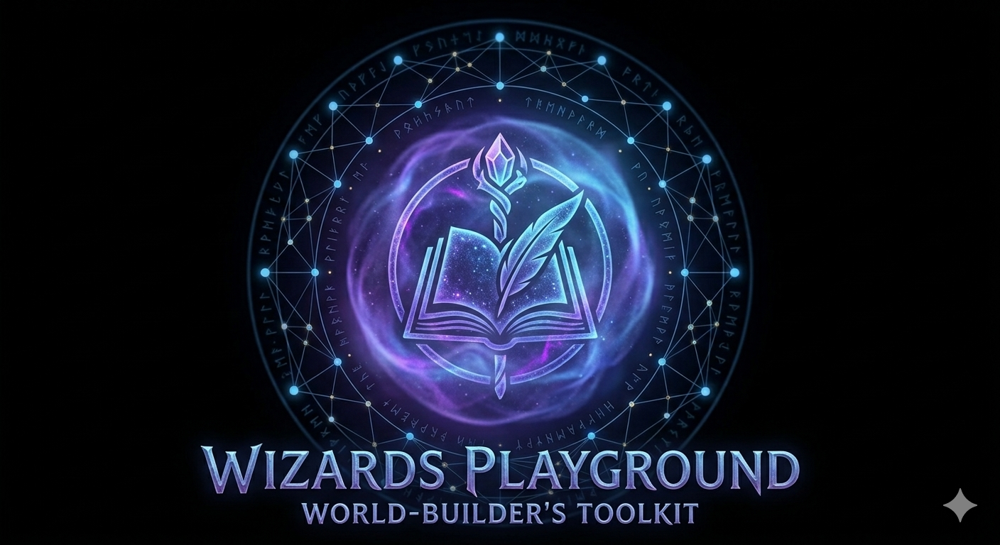

<div align="center">



# Wizards Playground

**A complete, local-first writing studio for authors.**

Write your manuscript. Build your world. Train an AI that sounds like you.

[](https://github.com/shaneweickum-lab/Scriptorium/releases/latest)
[](LICENSE)
[](https://github.com/shaneweickum-lab/Scriptorium/releases/latest)

</div>

---

## What is it?

Wizards Playground is a **free, offline-first PWA and desktop app** for fiction authors. Everything lives on your device — no account, no cloud, no subscription. Your words stay yours.

It combines a distraction-free manuscript editor, a structured world bible, an achievement system, and an on-device AI writing companion (Maven) into one cohesive studio.

---

## Features

### ✍️ Writing

- **Distraction-free editor** — full-screen focus mode with rich text formatting, find & replace, and per-book appearance controls
- **Hierarchical outline** — organise your manuscript into Parts, Chapters, Scenes, and Notes with drag-and-drop reordering
- **Manuscript assembly** — pick scenes in any order, add section breaks and front matter, then export in one click
- **Daily writing streaks** — calendar heatmap tracks your consistency session by session
- **Focus timer** — built-in Pomodoro timer with presets and break overlays

### 🌍 World Bible

- **Living lore database** — Characters, locations, magic systems, factions, and anything else, all in one searchable place
- **`@mention` autocomplete** — type `@` anywhere in your manuscript and instantly reference any world entry
- **In-editor world reference panel** — browse your lore without leaving the writing view
- **Custom fields and tags** — structure entries exactly how your project needs

### 📦 Export

- **KDP-ready Word export** — proper margins, headers, footers, page numbers, chapter headings, and auto-generated table of contents for Amazon Kindle Direct Publishing
- **EPUB** — clean reflowable ebook output
- **HTML** — single-file web export

### 🏆 Achievements & XP

- **30 unlockable badges** — milestones across word counts, world building, chapters, streaks, and more
- **Per-book XP** — every book has its own progression track
- **Level system** — watch your author level grow in the sidebar

---

## Maven — Your AI Writing Companion

> **Coming Soon** — Maven is actively being developed and is not yet functional in the current release.

Maven is a purpose-built AI writing companion powered by **MavenAI** — a small language model being trained from the ground up, exclusively for the craft of storytelling. She runs entirely on your device, needs no API keys, and no data ever leaves your machine.

Unlike general-purpose AI assistants, MavenAI is designed with a single purpose: to understand fiction, honour your lore, and write in your voice.

| Capability | What it does |
|---|---|
| **Chat** | Ask Maven anything about craft, plot, character, or structure |
| **Write mode** | Give a direction and Maven produces prose in your voice |
| **Lore-aware** | Maven reads your World Bible and grounds every answer in your lore |
| **Style matching** | Analyses your recent writing and mirrors your sentence rhythm, vocabulary, and tone |
| **Writer's Block Sensor** | Watches the editor for idle periods and write-delete loops, surfaces a gentle nudge when you're stuck |
| **Lore Sentinel** | Scans the scene you just wrote for lore-changing events and proposes World Bible updates |

### No setup required

MavenAI ships as part of the app — no third-party installs, no model downloads, no configuration. Open the app, open Maven, start writing.

---

## Training Portal — OracleML

The Training Portal lets you feed Maven your existing writing — journals, emails, short stories, anything — so she learns your voice before you write a single scene.

Paste your writing into one of four categories:

| Category | Purpose |
|---|---|
| Journal / Diary | Personal voice and daily rhythms |
| Emails / Messages | How you communicate naturally |
| Short Stories | Your narrative style and pacing |
| Other Writing | Anything else in your voice |

Every word analysed pushes Maven from Apprentice toward Journeyman, making her suggestions feel increasingly native to your style.

---

## Desktop App

The desktop app (built with [Tauri](https://tauri.app)) runs MavenAI natively — no setup, no configuration, no browser sandbox. Install it and Maven is ready the moment you open the app.

**[Download the latest release →](https://github.com/shaneweickum-lab/Scriptorium/releases/latest)**

| Platform | Format |
|---|---|
| macOS (Apple Silicon) | `.dmg` |
| macOS (Intel) | `.dmg` |
| Windows 10 / 11 | `.msi` |
| Linux x64 | `.deb` · `.AppImage` |

Or use it as a **PWA** — open the app in Chrome or Safari and install it from the address bar. Works fully offline after the first load.

---

## Tech Stack

| Layer | Technology |
|---|---|
| UI | React 19 + TypeScript 5.9 |
| Styling | Tailwind CSS 3 |
| State | Zustand 5 |
| Rich text | TipTap 3 (ProseMirror) |
| Storage | Dexie 4 (IndexedDB) |
| AI | MavenAI (purpose-built SLM) · `@xenova/transformers` for embeddings |
| Export | `docx` (Word) · `jszip` (EPUB) |
| PWA | Vite + `vite-plugin-pwa` (Workbox) |
| Desktop | Tauri 2 + `tauri-plugin-http` |

All data is stored in the browser's **IndexedDB** via Dexie. There is no server, no backend, and no network calls for core functionality.

---

## Development

**Prerequisites:** Node 20+, npm 10+, Rust 1.77+ (desktop only)

```bash
# Install dependencies
npm install

# Start the web dev server
npm run dev               # → http://localhost:5173

# Start the Tauri desktop app (dev mode)
npm run tauri:dev         # starts Vite + Tauri window

# Production build (web)
npm run build

# Production build (desktop installer)
npm run tauri:build
```

### Linux system dependencies (desktop only)

```bash
sudo apt-get install -y \
  libwebkit2gtk-4.1-dev \
  libgtk-3-dev \
  librsvg2-dev
```

---

## Releasing a new version

Push a version tag to trigger the cross-platform GitHub Actions build:

```bash
git tag v1.0.0
git push origin v1.0.0
```

This builds and attaches signed installers for all four platforms as a draft GitHub Release. See [`.github/workflows/publish-desktop.yml`](.github/workflows/publish-desktop.yml) for required secrets.

---

## Project Structure

```
src/
├── components/        # UI components (editor, library, world, Maven, etc.)
├── db/                # Dexie database schema and repositories
├── features/
│   └── ai-engine/     # Maven: Ollama client, RAG, style analysis, vector index
├── hooks/             # Shared React hooks
├── store/             # Zustand stores
├── types/             # Shared TypeScript interfaces
└── utils/             # TipTap serialisation helpers, tree utilities

src-tauri/             # Tauri desktop wrapper (Rust)
public/                # Static assets, PWA icons
```

---

<div align="center">

**Wizards Playground · Built for writers, by writers**

Free forever · No account · No cloud · Your words stay yours

</div>
